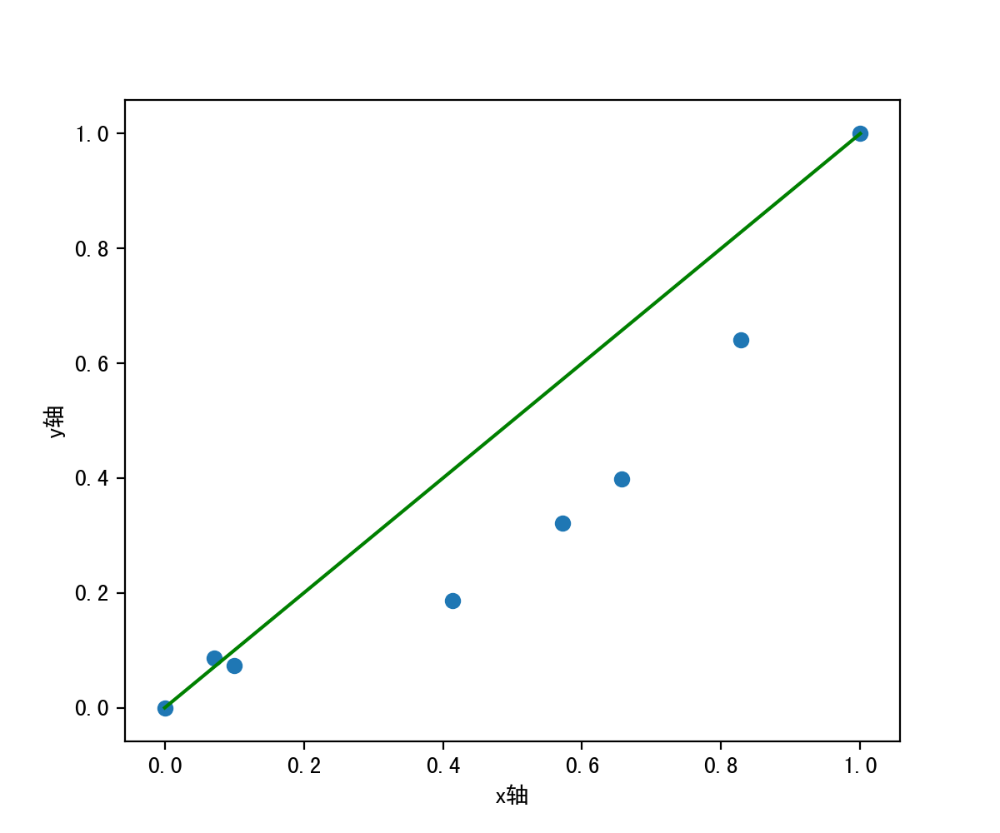
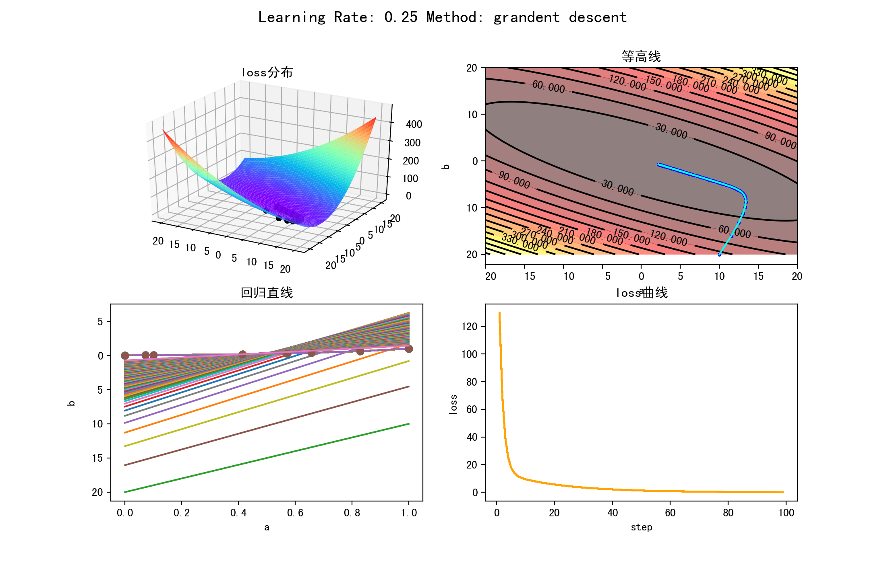
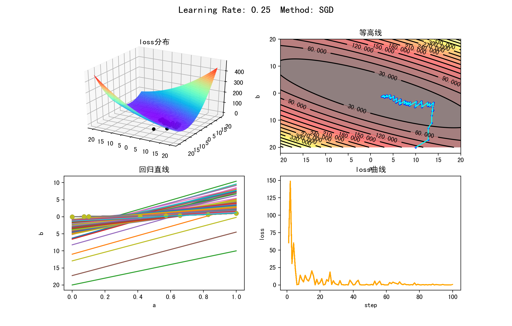
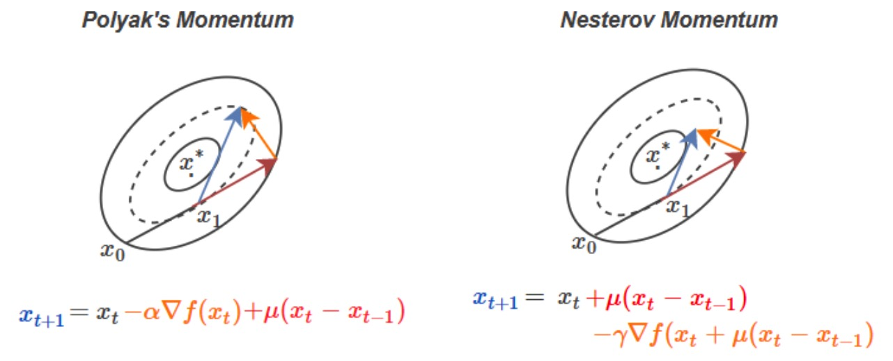
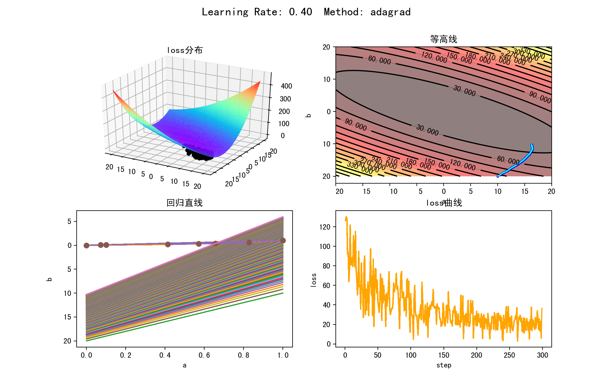
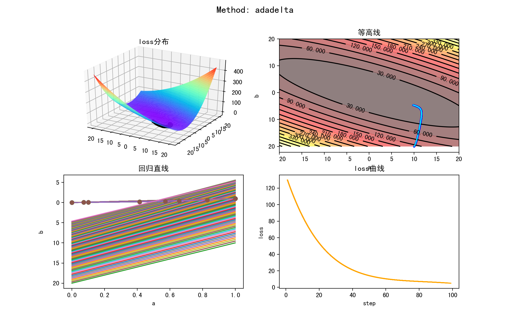
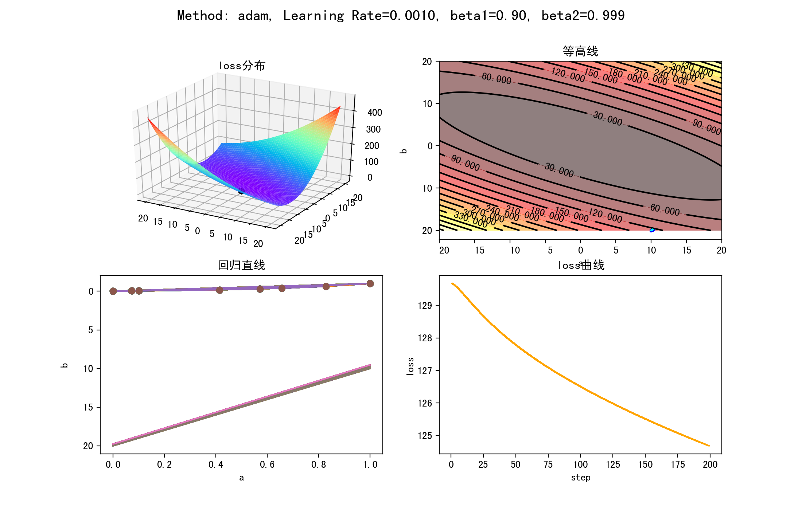

# 机器学习优化函数
> 注：如需正常显示公式，请在chrome浏览器中安装 [Github with MathJax](https://chrome.google.com/webstore/detail/github-with-mathjax/ioemnmodlmafdkllaclgeombjnmnbima) 插件

**目  录：**

  * [1、线性回归](#1线性回归)
  * [2、梯度下降](#2梯度下降)
  * [3、随机梯度下降（SGD）](#3随机梯度下降sgd)
  * [4、小批量随机梯度下降（minibath SGD）](#4小批量随机梯度下降minibath-sgd)
  * [5、动量法（momentum）](#5动量法momentum)
  * [6、Nesterov accelerated gradient (NAG)](#6nesterov-accelerated-gradient-nag)
  * [7、adagrad](#7adagrad)
  * [8、adadelta](#8adadelta)
  * [9、RMSprop](#9rmsprop)
  * [10、Adaptive Moment Estimation(adam)](#10adaptive-moment-estimationadam)
  * [11、adamax](#11adamax)
  * [12、nadam](#12nadam)
  * [总结](#总结)
     * [算法对比](#算法对比)
     * [算法选择](#算法选择)

## 1、线性回归

### 公式

线性模型：

$$y_{p,i}=ax_i+b$$

Loss方法：Mean Squared Error (MSE), 即均方差

$$loss=\frac{1}{2m}\sum_{i=1}^m(y_{p,i}-y_i)^2$$

### 实验

```
▶ python 1_linear_regression.py
loss = 0.013575
```
结果图：


## 2、梯度下降

梯度下降，又称批量梯度下降，基本步骤是:

- 对成本函数进行微分, 得到其在给定点的梯度. 梯度的正负指示了成本函数值的上升或下降:
- 选择使成本函数值减小的方向, 即梯度负方向, 乘以以学习率 计算得参数的更新量, 并更新参数:
- 重复以上步骤, 直到取得最小的成本

在每次更新时用所有样本，其计算得到的是一个标准梯度，对于最优化问题、凸问题，也肯定可以达到一个全局最优。因而理论上来说一次更新的幅度是比较大的。如果样本不多，收敛速度较快。

### 公式

每一次迭代按照一定的学习率 α 沿梯度的反方向更新参数，直至收敛。
$$y_{p,i}=ax_i+b$$
$${loss=\frac{1}{2m}\sum_{i=1}^m(y_{p,i}-y_i)^2 }$$

合并方程
$${loss=\frac{1}{m}\sum_{i=1}^m\frac12(ax_i+b-y_i)^2 }$$

一共有m个累加项，单独提取一项：
$${loss_{i}=\frac{1}{2}(ax_i+b-y_i)^2 }$$

分别对要优化的参数 a, b 求导:
$$\frac{\partial loss_{i}}{\partial a}=(ax_i+b-y_i)x_i$$
$$\frac{\partial loss_{i}}{\partial b}=(ax_i+b-y_i)$$

再累加起来：
$$\frac{\partial loss}{\partial a}=\frac{1}{m}\sum_{i=1}^m\frac{\partial loss_{i}}{\partial a}$$
$$\frac{\partial loss}{\partial b}=\frac{1}{m}\sum_{i=1}^m\frac{\partial loss_{i}}{\partial b}$$

上述结果分别表示为▽a和▽b，更新参数：

$$a_{new}=a-\alpha \nabla a$$
$$b_{new}=b-\alpha \nabla b$$

### 实验

```
▶ python 2_grandent_descent.py
('step: ', 1, ' loss: ', 129.67006756542807)
('step: ', 2, ' loss: ', 69.044827279798554)
('step: ', 3, ' loss: ', 39.638649527677572)
('step: ', 4, ' loss: ', 25.219075088346727)
('step: ', 5, ' loss: ', 18.001472787310952)
...
('step: ', 97, ' loss: ', 0.12468086790027612)
('step: ', 98, ' loss: ', 0.11886345232802056)
('step: ', 99, ' loss: ', 0.11333003026025744)
```

结果图片：



缺点：每进行一次迭代都需要计算所有样本，当样本量比较大的时候，会非常消耗计算资源，收敛速度会很慢。

## 3、随机梯度下降（SGD）

在每次更新时用随机的一个样本（而不是全部样本）来近似所有的样本，来调整参数。

因为计算得到的并不是准确的一个梯度，因而随机梯度下降会带来一定的问题，对于最优化问题，凸问题，虽然不是每次迭代得到的损失函数都向着全局最优方向， 但是大的整体的方向是向全局最优解的，最终的结果往往是在全局最优解附近。

但是相比于批量梯度，这样的方法更快，更快收敛，虽然不是全局最优，但很多时候是我们可以接受的，所以这个方法用的也比上面的多。

### 公式

经典的梯度下降方法中，对每个样本都要计算loss：

$${loss=\frac{1}{2m}\sum_{i=1}^m(y_{p,i}-y_i)^2 }$$

SGD计算loss如下：

$${loss=\frac{1}{2}(y_{p,i}-y_i)^2 }$$

分别对要优化的参数 a, b 求导:

$$\frac{\partial loss}{\partial a}=(ax_i+b-y_i)x_i$$
$$\frac{\partial loss}{\partial b}=(ax_i+b-y_i)$$

更新参数方法同上。

### 实验

```
▶ python 3_sgd.py
('step: ', 1, ' loss: ', 60.5)
('step: ', 2, ' loss: ', 148.78125)
('step: ', 3, ' loss: ', 30.752974944518261)
('step: ', 4, ' loss: ', 60.245692294926464)
('step: ', 5, ' loss: ', 24.154724333378837)
...
('step: ', 98, ' loss: ', 0.096628400058548211)
('step: ', 99, ' loss: ', 0.055388452188521113)
('step: ', 100, ' loss: ', 0.73856143994818635)
```

结果图片：



评价：整体上收敛，由于加入了随机的成分，局部有一些震荡，但对局部极小点可以跳出，得到全局最优解。

## 4、小批量随机梯度下降（minibath SGD）

其实就是一种折中的方法，在每次更新时用b个样本，其实批量的梯度下降，他用了一些小样本来近似全部的，其本质就是我1个指不定不太准，那我用个30个50个样本那比随机的要准不少了吧，而且批量的话还是非常可以反映样本的一个分布情况的。在深度学习中，这种方法用的是最多的，因为这个方法收敛也不会很慢，收敛的局部最优也是更多的可以接受！

### 公式

mini-batch 梯度下降法loss算法, k表示每一个batch的总样本数：

$${loss_{batch}=\frac{1}{2k}\sum_{i=1}^k(y_{p,i}-y_i)^2 }$$

分别对要优化的参数 a, b 求偏微分，再求和的均值:

$$\frac{\partial loss_{batch}}{\partial a}=\frac{1}{k}\sum_{i=1}^k(ax_i+b-y_i)x_i$$
$$\frac{\partial loss_{batch}}{\partial b}=\frac{1}{k}\sum_{i=1}^k(ax_i+b-y_i)$$

更新参数方法同梯度下降法。

### 实验

```
▶ python 4_minibatch_SGD.py
('step: ', 1, ' loss: ', 84.775082655486585)
('step: ', 2, ' loss: ', 46.355100998210879)
('step: ', 3, ' loss: ', 49.219614648252289)
('step: ', 4, ' loss: ', 19.426229561741049)
('step: ', 5, ' loss: ', 17.776692555046939)
...
('step: ', 97, ' loss: ', 0.18700274674544323)
('step: ', 98, ' loss: ', 0.15347107047759942)
('step: ', 99, ' loss: ', 0.18048695668068537)
```

实验结果：


可以看出，相比SGD，波动减小的比较明显，同时收敛速度大大加快。

> 注：由于mini-batch SGD 比 SGD 效果好很多，所以**一般说SGD都指的是 mini-batch gradient descent.** 不要和原始的SGD混淆。现在基本所有的大规模深度学习训练都是分为小batch进行训练的。

## 5、动量法（momentum）

SGD 在遇到沟壑时容易陷入震荡。为此，可以为其引入动量 Momentum，加速 SGD 在正确方向的下降并抑制震荡。

参数更新方向不仅由当前的梯度决定，也与此前累积的下降方向有关。这使得参数中那些梯度方向变化不大的维度可以加速更新，并减少梯度方向变化较大的维度上的更新幅度。由此产生了加速收敛和减小震荡的效果。

### 公式

参数更新公式：

$$v_t = \gamma v_{t-1} + \eta \nabla_\theta J( \theta) \\$$ 
$$\theta = \theta - v_t$$

> Note: Some implementations exchange the signs in the equations. The momentum term γ is usually set to 0.9 or a similar value.

很多实现只是等式符号不同，我这里用的是上减下加。如下伪代码：

```
# Momentum update
v = mu * v - learning_rate * dx # integrate velocity
x += v # integrate position
```

### 实验

```
▶ python 5_momentum.py
('step: ', 1, ' loss: ', 142.78026539628002)
('step: ', 2, ' loss: ', 57.026908010941987)
('step: ', 3, ' loss: ', 14.878695379467619)
('step: ', 4, ' loss: ', 27.956646187512142)
('step: ', 5, ' loss: ', 76.121314278701405)
...
('step: ', 97, ' loss: ', 0.0050963082785009679)
('step: ', 98, ' loss: ', 0.0025215223884579186)
('step: ', 99, ' loss: ', 0.0260781190424971)
```

 结果图片：


> 1、从等高线图就可以看出，momentum方法每一步走的都要更远一些。由于累加了动量，会带着之前的速度向前方冲去。比如一开始loss冲入了山谷，由于有之前的动量，继续朝着对面的山坡冲了上去。随着动量的更新，慢慢地最终收敛到最小值。
>
> 2、本实验看起来好像SGD比momentum更好，这是由于数据集简单等的原因

## 6、Nesterov accelerated gradient (NAG)

该方法与动量类似，也是考虑最近的梯度情况，但是NAG相对超前一点，使用动量计算参数下一个位置的近似值，然后在这近似值位置上计算梯度。


在momentum里，先计算当前的梯度（短蓝色线），然后结合以前的梯度执行更新（长蓝色线）。而在nesterov momentum里，先根据事先计算好的梯度更新（棕色），然后在预计的点处计算梯度（红色），结合两者形成真正的更新方向（绿色）。 

再来两张图比较momentum和NAG的区别：




图参考：[Nesterov’s Accelerated Gradient, Stochastic Gradient Descent](http://mitliagkas.github.io/ift6085/ift-6085-lecture-6-notes.pdf)

### 公式

参数更新公式

$$v_t = \gamma v_{t-1} + \eta \nabla_\theta J( \theta - \gamma v_{t-1} ) \\  $$
$$\theta = \theta - v_t$$

代码中我用的仍然是上减下加。伪代码如下：

```
x_ahead = x + mu * v
# evaluate dx_ahead (the gradient at x_ahead instead of at x)
v = mu * v - learning_rate * dx_ahead
x += v
```

### 实验

```
▶ python 6_NAG.py
('step: ', 1, ' loss: ', 146.04743572162121)
('step: ', 2, ' loss: ', 35.977107943103498)
('step: ', 3, ' loss: ', 6.0189021621300283)
('step: ', 4, ' loss: ', 19.533286578486837)
('step: ', 5, ' loss: ', 54.562743141431682)
...
('step: ', 97, ' loss: ', 0.0048164795494216803)
('step: ', 98, ' loss: ', 0.0030005463443346873)
('step: ', 99, ' loss: ', 0.0086091962512396744)
```

结果图片：


评价：相比较动量法，NAG方法收敛速度明显加快，波动也小了很多。因为NAG考虑了目标函数的二阶导数信息，而梯度下降是一阶收敛。二阶其实相当于考虑了梯度的梯度，所以相对更快。它比梯度下降法更具有全局判断能力，在二阶导数的作用下，从函数的凹凸性出发，直接搜索怎样到达极值点；而梯度法是从初始点的领域开始判断，在局部进行最速下降方向，然后步步逼近极值。所以梯度下降法需要迭代的次数更多。

具体可参看：[比Momentum更快：揭开Nesterov Accelerated Gradient的真面目](https://zhuanlan.zhihu.com/p/22810533)

## 7、adagrad

前面一系列【2~6】的优化算法有一个共同的特点，就是对于每一个参数都用相同的学习率进行更新。但是在实际应用中各个参数的重要性肯定是不一样的，所以对于不同的参数要动态的采取不同的学习率，让目标函数更快的收敛。

adagrad方法对每一个参数在每一步都使用不同的学习率，将每一个参数的每一次迭代的梯度取平方累加再开方，用基础学习率除以这个数，来做学习率的动态更新。

优点：主要优点之一就是无需手动调整学习率。大多数的实现使用默认的0.01作为学习率，而且保持不变。

缺点：缺点就是分母中平方梯度的累积。由于每个增加项都是正数，所以在训练过程中累积和不断增加。这反过来导致学习速率缩小并最终变得极小，此时算法不再能够学习到额外的知识。

### 公式

为了简便，用 $g_t$ 表示在时间步 t 处的梯度，$g_{t,i}$ 表示目标函数对参数 $\theta_i$ 在时间步 t 处的偏导。

$$g_{t, i} = \nabla_\theta J( \theta_{t, i} )$$

对于经典的SGD优化函数，对每个参数 $\theta_i$ 在每个时间步 t，更新公式如下：

$$\theta_{t+1,i}=\theta_{t,i} - \eta \cdot g_{t,i}$$

在这个参数更新规则下，adagrad基于已经针对 $\theta_i$计算的过去梯度，在每一步针对每个参数更改学习率 $\eta$ ，adagrad的优化函数如下：

$$\theta_{t+1,i}=\theta_{t,i}- \frac{\eta}{\sqrt{G_{t,i}+\epsilon}} \cdot g_{t,i}$$

其中t表示每一次迭代，$\epsilon$ 为一个极小值，防止分母为0，通常为 1e-8。

$G_{i,t}$ 表示前 t 步参数 $\theta_i$ 梯度的累加:

$$G_{i,t} = G_{i,t-1}+ \nabla_{\theta_{i,t}} J(\theta)$$

从公式可以看出，随着算法不断的迭代，$G_{i,t}$ 会越来越大，整体的学习率会越来越小。所以一般来说adagrad算法一开始是激励收敛，到了后面就慢慢变成惩罚收敛，速度越来越慢。

伪代码：

```
# Assume the gradient dx and parameter vector x
cache += dx**2
x += - learning_rate * dx / (np.sqrt(cache) + eps)
```

### 实验

```
▶ python 7_adagrad.py
('step: ', 1, ' loss: ', 126.59260375598554, 'rate_new a:', 0.065759594913256489, ' b:', 0.025928148941541867)
('step: ', 2, ' loss: ', 130.28408907994719, 'rate_new a:', 0.05163977794512891, ' b:', 0.01820063020754319)
('step: ', 3, ' loss: ', 128.52614309900483, 'rate_new a:', 0.043905703993231217, ' b:', 0.014784425418990471)
('step: ', 4, ' loss: ', 92.199042764388466, 'rate_new a:', 0.035494260375247139, ' b:', 0.01328910988362857)
('step: ', 5, ' loss: ', 93.989115250161589, 'rate_new a:', 0.031524416248585006, ' b:', 0.012182898077406948)
...
('step: ', 297, ' loss: ', 23.068854311024474, 'rate_new a:', 0.011821082491259216, ' b:', 0.0032171350536291015)
('step: ', 298, ' loss: ', 5.8469320056443781, 'rate_new a:', 0.011815923825296271, ' b:', 0.0032171350536291015)
('step: ', 299, ' loss: ', 36.444065472904867, 'rate_new a:', 0.011815923825296271, ' b:', 0.003213706766330305)
```

结果图片：



> 可以看出收敛速度的确是特别慢，学习率低到可怜，我已经将初始学习率设为0.4了，原因参见上面说的缺点。

## 8、adadelta

这个算法是对 Adagrad 的改进，旨在减少adagrad积极单调降低的学习率。和 Adagrad 相比，adadelta并不积累过去所有的梯度平方，而是只积累固定大小的项。

### 公式

之前梯度的总和递归的定义为过去所有梯度平方的平均，现在，在时间 t 处，梯度平方的平均 $E[g^2]_t$ 取决于先前的平均值和当前的梯度 ：

$$E[g^2]_t = \gamma E[g^2]_{t-1} + (1 - \gamma) g^2_t$$

$\gamma$ 和 momtentum 中类似，也为0.9。

为了清晰，用参数更新矢量 $\Delta \theta_t$ 来重写SGD的更新：

$$\Delta \theta_t = - \eta \cdot g_{t, i}$$

$$\theta_{t+1} = \theta_t + \Delta \theta_t$$

参数更新矢量重写adagrad更新：

$$\Delta \theta_t = - \dfrac{\eta}{\sqrt{G_{t} + \epsilon}} \odot g_{t}$$

现在简单的用过去平方梯度的衰减平均值 $E[g^2]_t$ 来替代对角矩阵 $G_t$ ：

$$\Delta \theta_t = - \dfrac{\eta}{\sqrt{E[g^2]_t + \epsilon}} g_{t}$$

由于分母只是梯度的均方根root mean squared（RMS）误差准则，所以可以用简写来替代它：

$$\Delta \theta_t = - \dfrac{\eta}{RMS[g]_{t}} g_t$$

作者指出，此更新中的单位（以及SGD，Momentum或Adagrad）不匹配，即更新应该与参数具有相同的假设单位（而不是梯度）。为了实现这一点，他们首先定义了另一个指数衰减的平均值，这次不是平方梯度，而是平方参数更新：

$$E[\Delta \theta^2]_t = \gamma E[\Delta \theta^2]_{t-1} + (1 - \gamma) \Delta \theta^2_t$$

参数更新的均方根误差：

$$RMS[\Delta \theta]_{t} = \sqrt{E[\Delta \theta^2]_t + \epsilon}$$

用 $RMS[\Delta \theta]_{t-1}$ 来代替学习率 $\eta$ ，得到新的更新规则：

$$\Delta \theta_t = - \dfrac{RMS[\Delta \theta]_{t-1}}{RMS[g]_{t}} g_{t}$$

$$\theta_{t+1} = \theta_t + \Delta \theta_t$$

此时，我们甚至都不需要设置默认的学习率，因为参数更新规则已经不受它影响了。

### 实验

```
▶ python 8_adadelta.py
('step: ', 1, ' loss: ', 129.67006756542807, 'rms_theta/rms_g:', array([ 0.00250418,  0.00250418], dtype=float32))
('step: ', 2, ' loss: ', 124.0088104228617, 'rms_theta/rms_g:', array([ 0.00197095,  0.00260129]))
('step: ', 3, ' loss: ', 118.58396330052152, 'rms_theta/rms_g:', array([ 0.00172271,  0.00266956]))
('step: ', 4, ' loss: ', 113.36052966432771, 'rms_theta/rms_g:', array([ 0.00157467,  0.00272375]))
('step: ', 5, ' loss: ', 108.33161470256843, 'rms_theta/rms_g:', array([ 0.00147579,  0.00276966]))
...
('step: ', 97, ' loss: ', 5.2284673996315023, 'rms_theta/rms_g:', array([ 0.01625883,  0.01534139]))
('step: ', 98, ' loss: ', 5.0965586036092185, 'rms_theta/rms_g:', array([ 0.01726585,  0.01591376]))
('step: ', 99, ' loss: ', 4.9608085851769861, 'rms_theta/rms_g:', array([ 0.01834156,  0.01650829]))
```

结果图片：



> 注：这里用的是批量的数据做迭代，不然图太难看了

## 9、RMSprop

与adadelta算法的第一种形式相同

$$E[g^2]_t = \eta E[g^2]_{t-1} + (1-\eta) g^2_t$$

$$\theta_{t+1} = \theta_{t} - \dfrac{\eta}{\sqrt{E[g^2]_t + \epsilon}} g_{t}$$

作者建议将 $\eta$ 设为0.9，学习率 $\eta$ 设为 0.001

伪代码：

```
cache = decay_rate * cache + (1 - decay_rate) * dx**2
x += - learning_rate * dx / (np.sqrt(cache) + eps)
```

## 10、Adaptive Moment Estimation(adam)

自适应矩估计（Adam）是计算每个参数的自适应学习率的另一种方法。除了像Adadelta和RMSprop存储指数衰减的过去平方梯度的平均值 $v_t$ 之外，Adam还保持了过去梯度 $m_t$ 的指数衰减平均值，类似于动量。过去梯度和平方梯度的衰减平均值如下：

$$m_t = \beta_1 m_{t-1} + (1 - \beta_1) g_t$$

$$v_t = \beta_2 v_{t-1} + (1 - \beta_2) g_t^2 $$

其中 $m_t$ 和 $v_t$ 分别是梯度的一阶矩估计和二阶矩估计。由于二者被初始化为0的向量，作者观察到它们偏向0，特别是在最初的时间步骤中，特别是当衰减率很小时（$\beta_1$ 和 $\beta_2$ 接近1）。

通过计算偏差校正的一阶和二阶矩估计来抵消偏差，近似无偏估计：

$$\hat{m}_t = \dfrac{m_t}{1 - \beta^t_1}$$

$$\hat{v}_t = \dfrac{v_t}{1 - \beta^t_2}$$

然后用它们来更新参数：

$$\theta_{t+1} = \theta_{t} - \dfrac{\eta}{\sqrt{\hat{v}_t} + \epsilon} \hat{m}_t$$

作者建议的默认值：$\beta_1 = 0.9$，$\beta_2 = 0.999$，$\epsilon = 10^{-8}$

实践经验表明，Adam在实践中表现良好，并且与其他自适应学习方法算法相比更有优势。

Adam 结合了 AdaGrad 和 RMSProp 算法最优的性能，它还是能提供解决稀疏梯度和噪声问题的优化方法。

Adam 的调参相对简单，默认参数就可以处理绝大部分的问题。

伪代码：

```
# t is your iteration counter going from 1 to infinity
m = beta1*m + (1-beta1)*dx
mt = m / (1-beta1**t)
v = beta2*v + (1-beta2)*(dx**2)
vt = v / (1-beta2**t)
x += - learning_rate * mt / (np.sqrt(vt) + eps)
```

### 实验

```
▶ python 10_adam.py
('step: ', 1, ' loss: ', 129.67006756542807)
('step: ', 2, ' loss: ', 129.64820770265246)
('step: ', 3, ' loss: ', 129.61883517467558)
('step: ', 4, ' loss: ', 129.58462519945039)
('step: ', 5, ' loss: ', 129.5470260748383)
...
('step: ', 197, ' loss: ', 124.7207718921178)
('step: ', 198, ' loss: ', 124.70495040750595)
('step: ', 199, ' loss: ', 124.68916675811745)
```

结果图片：



> adam算法对于大规模的深度学习应用效果会更好，故在当前小规模的简单凸函数优化问题上收敛速度并不快

## 11、adamax

该方法是基于无穷范数的Adam方法的变体。

adam方法中的 $v_t$ 因子按照过去梯度（通过 $v_{t-1}$ 项）和当前梯度 $|g_t|^2$ 的L2正则成反比例的调整梯度:

$$v_t = \beta_2 v_{t-1} + (1 - \beta_2) |g_t|^2$$

可以将此更新泛化成Lp正则:

$$v_t = \beta_2^p v_{t-1} + (1 - \beta_2^p) |g_t|^p$$

p特别大的范式通常在数值上不稳定，这就是为什么L1和L2范式在实践中常见的原因。出于这个原因，作者提出adamax并且证明L无穷大下的 $v_t$ 收敛于一个更稳定的值。为了避免和 adam中混淆，使用 $u_t$ 来表示无穷范数约束下的 $v_t$ ：

$$\begin{align} \begin{split} u_t &= \beta_2^\infty v_{t-1} + (1 - \beta_2^\infty) |g_t|^\infty\\   & = \max(\beta_2 \cdot v_{t-1}, |g_t|) \end{split} \end{align}$$

然后将此公式插入 adam 更新公式中，取代 $\sqrt{\hat{v}_t} + \epsilon$ ：

$$\theta_{t+1} = \theta_{t} - \dfrac{\eta}{u_t} \hat{m}_t$$

> 由于 $u_t$ 依赖于最大操作，所以并不像adam算法中的 $m_t$ 和 $v_t$ 一样偏向于0，这就是为什么不需要再为 $u_t$ 计算偏差矫正的原因。

建议默认值: $\eta = 0.002, \beta_1 = 0.9, \beta_2 = 0.999$

## 12、nadam

如之前所述，adam可以看做 RMSprop和momentum方法的组合：RMSprop贡献了过去平方梯度 $v_t$ 的指数衰减平均值，而momentum考虑了过去梯度 $m_t$ 的指数衰减平均值。同时，Nesterov accelerated gradient (NAG)优于普通momentum方法。

Nadam (Nesterov-accelerated Adaptive Moment Estimation) 因此组合 Adam 和NAG方法。为了将NAG纳入adam中，这里需要修改动量术语 $m_t$ 。

首先，回顾一下动量更新规则中目前使用的标注符号：

$$\begin{align} \begin{split} g_t &= \nabla_{\theta_t}J(\theta_t)\\ m_t &= \gamma m_{t-1} + \eta g_t\\ \theta_{t+1} &= \theta_t - m_t\end{split}\end{align}$$

其中 $J$ 是目标函数，$\gamma$ 是动量衰减项，$\eta$ 是学习步长。

$$\theta_{t+1} = \theta_t - ( \gamma m_{t-1} + \eta g_t)$$

该公式再次表明动量涉及向之前的动量矢量方向迈出一步，并沿当前梯度的方向上迈出一步。 

NAG然后允许我们在梯度方向上执行更精确的步骤，方法是在计算梯度之前用动量步长更新参数。因此，我们只需要修改梯度 $g_t$ 到达NAG：

$$\begin{align} \begin{split} g_t &= \nabla_{\theta_t}J(\theta_t - \gamma m_{t-1})\\ m_t &= \gamma m_{t-1} + \eta g_t\\  \theta_{t+1} &= \theta_t - m_t\end{split}\end{align}$$ 

Dozat提出以如下方式修改NAG：相比于将动量步骤应用两次（一次用于更新梯度$g_t$，第二次用于更新参数$\theta_(t+1)$），现在应用前瞻动量矢量来直接更新当前参数：

$$\begin{align}\begin{split}g_t &= \nabla_{\theta_t}J(\theta_t)\\   m_t &= \gamma m_{t-1} + \eta g_t\\ \theta_{t+1} &= \theta_t - (\gamma m_t + \eta g_t)\end{split}\end{align}$$

注意，现在使用当前的动量向量 $m_t$ 来展望，而不是像上面的扩展动量更新规则的等式那样利用先前的动量向量 $m_{t-1}$。为了将 Nesterov动量加入adam中，我们可以类似地用当前动量向量代替以前的动量向量。

首先，回忆之前的adam更新规则(注意没必要修改 $\hat{v}_t$)：

$$\begin{align} \begin{split}m_t &= \beta_1 m_{t-1} + (1 - \beta_1) g_t\\  \hat{m}_t & = \frac{m_t}{1 - \beta^t_1}\\\theta_{t+1} &= \theta_{t} - \frac{\eta}{\sqrt{\hat{v}_t} + \epsilon} \hat{m}_t\end{split}\end{align}$$

用 $m_t$ 和 $\hat{m}_t$ 的定义来扩展第三个公式:

$$\theta_{t+1} = \theta_{t} - \dfrac{\eta}{\sqrt{\hat{v}_t} + \epsilon} (\dfrac{\beta_1 m_{t-1}}{1 - \beta^t_1} + \dfrac{(1 - \beta_1) g_t}{1 - \beta^t_1})$$

发现公式 $\dfrac{\beta_1 m_{t-1}}{1 - \beta^t_1}$ 只是前一时间步动量向量的偏差矫正估计值，因此可以用 $\hat{m}_{t-1}$ 来替代它：

$$\theta_{t+1} = \theta_{t} - \dfrac{\eta}{\sqrt{\hat{v}_t} + \epsilon} (\beta_1 \hat{m}_{t-1} + \dfrac{(1 - \beta_1) g_t}{1 - \beta^t_1})$$

该方程再次看起来非常类似于我们上面扩展的动量更新规则。我们现在可以像以前那样扩展Nesterov动量一样，用当前动量向量的偏差校正估计值 $\hat{m}_t$ 替换前一个时间步长的动量向量的偏差校正估计值 $\hat{m}_{t-1}$，得到Nadam更新规则：

$$\theta_{t+1} = \theta_{t} - \dfrac{\eta}{\sqrt{\hat{v}_t} + \epsilon} (\beta_1 \hat{m}_t + \dfrac{(1 - \beta_1) g_t}{1 - \beta^t_1})$$

$\hat{v}_t$ 保持不变：

$$v_t = \beta_2 v_{t-1} + (1 - \beta_2) g_t^2 $$

$$\hat{v}_t = \dfrac{v_t}{1 - \beta^t_2}$$

## 总结

### 算法对比

loss表面轮廓图：


如上图所示：Adagrad，Adadelta和RMSprop几乎立刻朝着正确的方向前进，并且同样快速地收敛，而Momentum和NAG则基于动量的方法的“超调”行为，这使得优化看起来像一个滚下山丘的球。然而，NAG很快就能够通过"向前看"来快速响应并纠正方向，并达到最小值。

鞍点图:


SGD，Momentum和NAG很难破除对称性，尽管后者最终设法摆脱了鞍点，但只有非常低的梯度，SGD则陷于顶部。而Adagrad，RMSprop和Adadelta迅速降低了负斜率，由于更新中的分母项，增加沿这个方向的有效学习速率，从而帮助算法继续。

自适应学习速率方法，即Adagrad，Adadelta，RMSprop和Adam是最合适的，并为这些情景提供最佳收敛。

### 算法选择

- 如果您的输入数据稀少，那么可能会使用自适应学习率方法中的一种获得最佳结果。另外一个好处是，你不需要调整学习速率，却可以使用默认值得到最佳结果。

- RMSprop是Adagrad的延伸，它处理其学习速度急剧下降的问题。它与Adadelta相同，只是Adadelta在分子更新规则中使用RMS参数更新。 Adam最后为RMSprop增加了偏差修正和动量。就此而言，RMSprop，Adadelta和Adam是非常相似的算法，在相似的情况下效果都很好。 偏差修正有助于Adam在优化结束时略微优于RMSprop，因为梯度变得更加稀疏。就三者而言，Adam可能是最好的综合选择。
- Nadam对学习率有了更强的约束，同时对梯度的更新也有更直接的影响。一般而言，在想使用带动量的RMSprop，或者Adam的地方，大多可以使用Nadam取得更好的效果。

**参考资料：**

http://ruder.io/optimizing-gradient-descent/index.html

http://cs231n.github.io/neural-networks-3/

https://zhuanlan.zhihu.com/p/22252270
